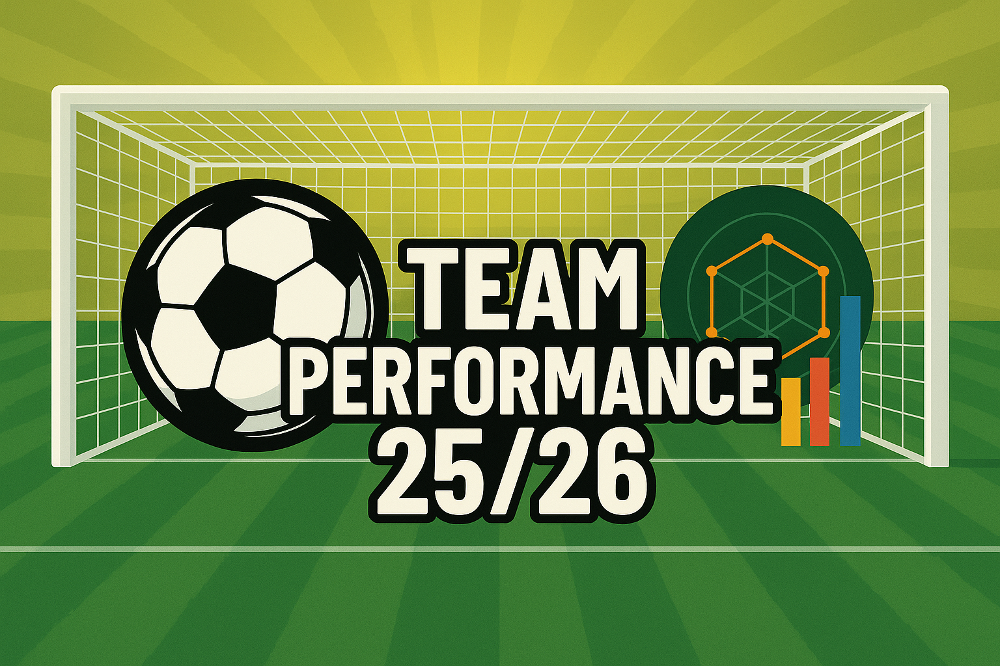

### Français

# Projet de visualisation des performances des équipes et des joueurs du Big 5 sur la saison 2025/26

L’objectif de ce projet sera constitué de deux parties distinctes : Équipe et Joueurs, à partir de diverses sources de données.

Au sein de la partie équipe, il sera notamment possible d’analyser l’équipe de son choix et de la comparer à d’autres équipes du Big 5, de manière globale ou sur des statistiques spécifiques.
Dans la partie joueur, la même logique sera appliquée avec une évaluation rigoureuse des joueurs au regard de leurs statistiques personnelles au cours de la saison. L’application permettra par ailleurs de cibler le ou les profils souhaités à partir du renseignement de critères statistiques précis. Cette application sera mise à jour hebdomadairement.

Le projet est disponible à ce lien : https://big5-styles-of-play.streamlit.app/

### English

# Visualization Project of Big 5 Teams and Players Performance for the 2025/26 Season

The objective of this project is divided into two distinct sections: Teams and Players, based on various data sources.

In the team section, users can analyze a team of their choice and compare it with other Big 5 teams, either globally or through specific statistical metrics.
In the player section, the same approach is applied with a rigorous evaluation of players based on their individual seasonal statistics. The application also allows users to identify one or several player profiles by selecting specific statistical criteria. The application will be updated on a weekly basis.

The project is available at the following link: https://big5-styles-of-play.streamlit.app/

### Español

# Proyecto de visualización del rendimiento de equipos y jugadores del Big 5 en la temporada 2025/26

El objetivo de este proyecto se divide en dos partes diferenciadas: Equipos y Jugadores, a partir de diversas fuentes de datos.

En la sección de equipos, será posible analizar el equipo de su elección y compararlo con otros equipos del Big 5, ya sea de manera global o a través de estadísticas específicas.
En la sección de jugadores, se aplica la misma lógica mediante una evaluación rigurosa de los jugadores en función de sus estadísticas individuales a lo largo de la temporada. La aplicación también permitirá identificar uno o varios perfiles deseados mediante la selección de criterios estadísticos concretos. La aplicación se actualizará semanalmente.

El proyecto está disponible en el siguiente enlace: https://big5-styles-of-play.streamlit.app/